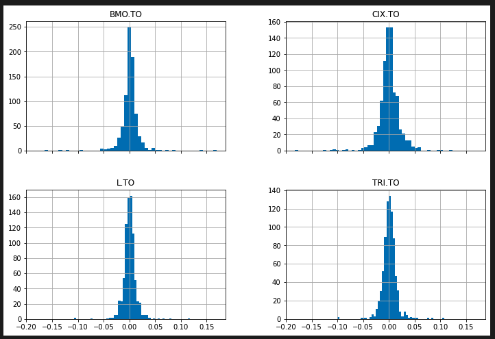

# Algorithmic Machine Learning Trader

## Scope and Purpose

Our priject is to build an algorithmic machine learning trading bot. 
The goal of this project is to build a predictive model into an algorithmic strategy utilizing technical indicators as well as hyperparameter tuning. 

## Data Sources
YFinance

## Libraries

This project requires the pandas, numpy, hvplot, matplotlib, sklearn, finta, yfinance libraries.

## Contributors

Tyeson Demets (tyedem), Trevor Yeomans (Yu9Psx2), Clauda Martinez (brilliantlyc), Khalid Romain (krom17), Atousa Mirzaei-Rezaei (atoosa-m)

# Final Model - Support Vector Machines vs. DMAC Strategy vs. Actual Returns
---

# Summary Report
---
For this project, we decided to select some of Canada's best performing stocks in the Toronto Stock Exchange (TSX), as per [insert source]. The chosen stocks include Loblaws (L.TO), Bank of Montreal (BMO.TO), Thomson Reuters Corp. (TRI.TO) and CI Financial (CI.TO). Our backtesting process includes designing a dual moving average crossover strategy (DMAC) to compare the performance with the actual market returns and the machine learning algorithmic strategy returns. Overall performance is captured in the plots above.

Our DMAC strategy was designed with a short simple moving average (SMA) window of 50 days and a long window of 100 days. These values were selected due to their common use amongst traders.

Since generating trade signals is a classification problem, we needed to implement supervised learning to our algorithmic machine learning (ML) strategy. The features utilized for our models include the finta library to efficiently calculate a number of indicators and include them into our portfolio DataFrame with open, high, low, close values. A few sklearn ML models were explored including the Random Forest Classifier, the Voting Classifer and the Support Vector Machine Classifier.

# Plots
## Closing Prices

## Returns Distribution

## DMAC Strategy

## Algo Strategy

# Metrics

## Performance Total % Returns - March 2021 - March 2022

  

