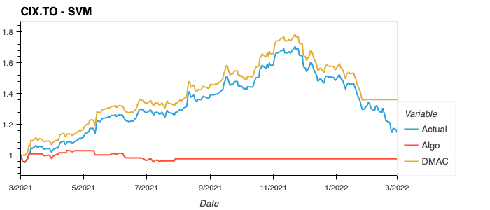
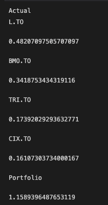
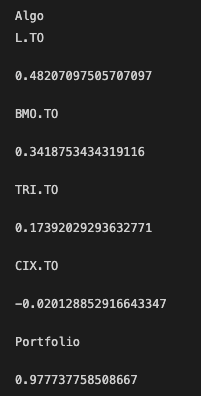

# Algorithmic Machine Learning Trader

## Scope and Purpose

Our project is to build an algorithmic machine learning trading bot. 
The goal of this project is to build a predictive model into an algorithmic strategy utilizing technical indicators as well as hyperparameter tuning. 

## Data Source
Yahoo Finance

## Libraries

This project requires the pandas, numpy, hvplot, matplotlib, sklearn, finta, yfinance libraries.

## Contributors

Tyeson Demets (tyedem), Trevor Yeomans (Yu9Psx2), Clauda Martinez (brilliantlyc), Khalid Romain (krom17), Atousa Mirzaei-Rezaei (atoosa-m)

# Final Model - Support Vector Machines vs. DMAC Strategy vs. Actual Returns
---

# Summary Report
---
For this project, we decided to select some of Canada's best performing stocks in the Toronto Stock Exchange (TSX), as per [insert source]. The chosen stocks include Loblaws (L.TO), Bank of Montreal (BMO.TO), Thomson Reuters Corp. (TRI.TO) and CI Financial (CI.TO). Our backtesting process includes designing a dual moving average crossover strategy (DMAC) to compare the performance with the actual market returns and the machine learning (ML) algorithmic (Algo) strategy returns. Overall performance is captured in the plots above.

Our DMAC strategy was designed with a short simple moving average (SMA) window of 50 days and a long window of 100 days. These values were selected due to their common use amongst traders.

Since generating trade signals is a classification problem, we needed to implement supervised learning to our Algo ML strategy. The features utilized for our models include the finta library to efficiently calculate a number of indicators and include them into our portfolio DataFrame with open, high, low, close values obtained from Yahoo Finance. A few sklearn ML models were explored including the Random Forest Classifier, the Voting Classifer and the Support Vector Machine Classifier.

Overall, the DMAC strategy outperforms both the actual portfolio returns and the algorithmic strategy returns when comparing total percent returns for the ML models prediction period of March 2021 - March 2022. Performance differences are captured below.

## Total % Returns - March 2021 - March 2022

  

# Model Training Process
---
## Feature Engineering with finta library
---
The finta library was an easy way to add additional features in the form of mathematically calculated technical indicators. Taking as an argument a pandas dataframe with open, high, low, close data, finta returns a column with the results of the calculation. For many of the technical indicators, an optional integer argument can be passed in order to change the period of the calculation, e.g. 5-day moving average or 10-day moving average.

---
## Fitting and transforming with StandardScaler()
---
We used StandardScaler to scale the data and then separated the data into training and test groups. We didn't use train_test_split and ran into one unintended consequence that we caught when debugging our script:

Our data is based on trading days, while our use of DateOffset was considering calendar days. We fixed this by using the month instead.

---
## Model selection
---
While coding our notebook we rotated through several different models, including Random Forest Classifier, Logistic Regression, and Support Vector Classifier. Since our label was based on stock price direction, we understood that a given model might not be better than random chance at making predictions. 

The support vector classifier performed the best, with accuracy scores ranging for the four stocks in the 49% to 56%, so we selected it for our algorithm.

# Hyperparameter Optimization/Tuning

Hyperparameter optimization (HPO) is the process by which we aim to improve the performance of a model by choosing the right set of hyperparameters. Some Hyperparameter Examples: criterion max_depth min_samples_split

Grid Search In grid search, we try every combination of the set of hyperparameters that the user-specified. Grid search is implemented in scikit-learn under the name of GridSearchCV Grod Search should be used if the model you are tuning does not have too many parameters, or if you don’t have too much training data.

In HPO, we generally : Select a set of hyperparameters to test Train a model with those hyperparameters on validation data Evaluate the performance of the model Move on to the next set of hyperparameters Keep the hyperparameters which improve the performance the most

#Hyperperameter Algorithm:Grid search #Random Forest from sklearn.model_selection import GridSearchCV

# Plots
## Closing Prices

## Returns Distribution

## DMAC Strategy

## Algo Strategy

# Metrics

