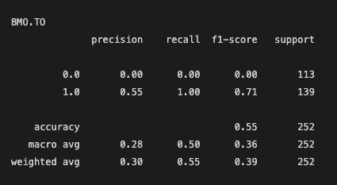
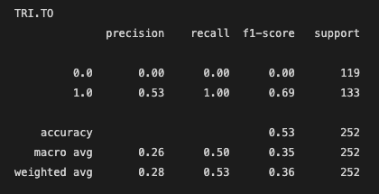
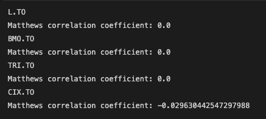
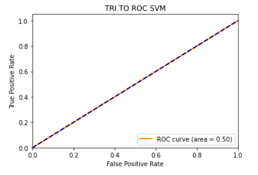
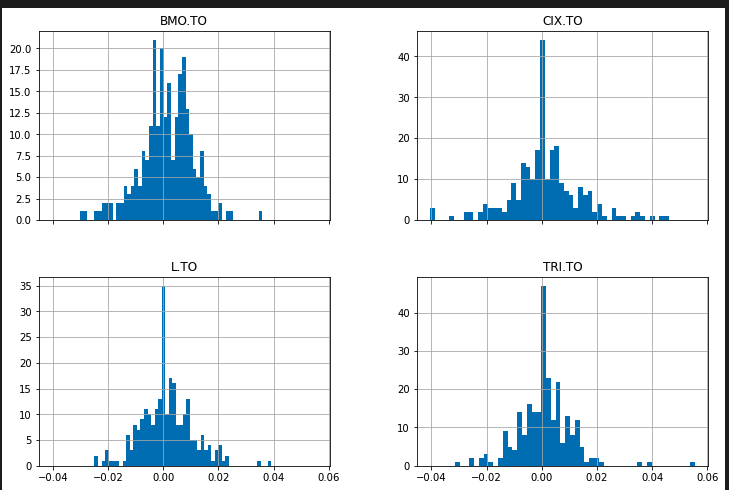

# Algorithmic Machine Learning Trader

## Scope and Purpose

Our project is to build an algorithmic machine learning trading bot. 
The goal of this project is to build a predictive model into an algorithmic strategy utilizing technical indicators as well as hyperparameter tuning. 

## Data Source
Yahoo Finance

## Libraries

This project requires the pandas, numpy, hvplot, matplotlib, sklearn, finta, yfinance libraries.

## Contributors

Tyeson Demets (tyedem), Trevor Yeomans (Yu9Psx2), Claudia Martinez (brilliantlyc), Khalid Romain (krom17), Atousa Mirzaei-Rezaei (atoosa-m)

# Final Model - Support Vector Machines vs. DMAC Strategy vs. Actual Returns
---

# Summary Report
---
For this project, we decided to select some of Canada's best performing stocks in the Toronto Stock Exchange (TSX), as per [Morning Star Direct](https://www.morningstar.ca/ca/news/217522/10-top-performing-canadian-stocks-in-2021.aspx). The chosen stocks include Loblaws (L.TO), Bank of Montreal (BMO.TO), Thomson Reuters Corp. (TRI.TO) and CI Financial (CIX.TO). Our backtesting process includes designing a dual moving average crossover strategy (DMAC) to compare the performance with the actual market returns and the machine learning (ML) algorithmic (Algo) strategy returns. Overall performance is captured in the plots above.

Our DMAC strategy was designed with a short simple moving average (SMA) window of 50 days and a long window of 100 days. These values were selected due to their common use amongst traders.

Since generating trade signals is a classification problem, we needed to implement supervised learning to our Algo ML strategy. The features utilized for our models include the finta library to efficiently calculate a number of indicators and include them into our portfolio DataFrame with open, high, low, close values obtained from Yahoo Finance. A few sklearn ML models were explored including the Random Forest Classifier, the Voting Classifer and the Support Vector Machine Classifier.

Overall, the DMAC strategy outperforms both the actual portfolio returns and the algorithmic strategy returns when comparing total percent returns for the ML models prediction period of March 2021 - March 2022. Performance differences are captured below.

## Total % Returns - March 2021 - March 2022

  

# Model Training Process
---
## Feature Engineering with finta library
---
The finta library was an easy way to add additional features in the form of mathematically calculated technical indicators. Taking as an argument a pandas dataframe with open, high, low, close data, finta returns a column with the results of the calculation. For many of the technical indicators, an optional integer argument can be passed in order to change the period of the calculation, e.g. 5-day moving average or 10-day moving average.

---
## Fitting and transforming with StandardScaler()
---
We used StandardScaler to scale the data and then separated the data into training and test groups. We didn't use train_test_split and ran into one unintended consequence that we caught when debugging our script:

Our data is based on trading days, while our use of DateOffset was considering calendar days. We fixed this by using the month instead.

---
## Model selection
---
While coding our notebook we rotated through several different models, including Random Forest Classifier, Logistic Regression, and Support Vector Classifier. Since our label was based on stock price direction, we understood that a given model might not be better than random chance at making predictions. 

The support vector classifier performed the best, with accuracy scores ranging for the four stocks in the 49% to 56%, so we selected it for our algorithm.

---
## Model Performance Evaluation
---

To evaluate the performance of our model we used the 4 metrics listed below. 

### Metrics:

* Classification Report
* Zero One Loss
* Matthews Correlation Coefficient
* ROC Curve 

The Classification Report includes information on the precision, recall, f1-score, and accuracy of the model. The Zero One Loss is a measure of the % of imperfectly predicted subsets. The count of such imperfectly predicted subsets was also obtained. The Matthews Correlation Coefficient (MCC) is a coefficient of +1, 0, or -1 which is representative of a perfect prediction, an average random prediction or an inverse prediction respectively. Lastly, the ROC Curve is a measure of the model performance as the descrimination threshold varies. It is better to have a larger AUC and a steeper curve as this indicates a better model performance. A steeper curve (larger slope if straight line) essentially means that the change in true positive rate is greater than the change in false positive rate for any given threshold. 

**Classification Reports**

Following are the classification reports for the 4 stocks analyzed in our project. The L.TO stock had the best accuracy, precision, and f1-score and the CIX.TO stock performed the worst using our model and algorithm. However, overall it is evident that the model itself did not do so well at producing good results for the 4 stocks.

**Zero One Loss**

Next, we consider the zero one loss for the stocks and these values reiterate the results from the classification report which show that the L.TO stock did the best while the CIX.TO stock performed the worst. A lower zero one loss value is preferred.

**Zero One Loss Subsets Count**

Following is the screenshot of the count of the imperfectly predicted subsets considered in the zero one loss metric. This just shows how the CIX.TO stock which had the highest zero one loss value indeed had a higher count of imperfectly predicted subsets. Also, we can obtain the zero one loss using the values below and dividing by the support value in the classification report for each respective stock.

**Matthews Correlation Coefficient**

As can be seen from the Matthews correlation coefficients below, the model performance for most stocks was average random since the coefficient was 0. The CIX.TO stock is a little below zero making it a slightly inverse prediction.   

**ROC Curve**

The ROC Curves below show what the above metrics have already shown, and that is that the model performance was not that good since the model was able to predict pretty much at random or slightly worse. The dashed blue line is the random performance line, and AUC for most stocks was 0.50.

**Summary**

The following screenshot shows the metrics together in one tabular form. In summary, the one stock that performed the best using our model was the L.TO stock. But there was not much difference between all the stocks. The model did not perform so well as it was very close to a random prediction.  

# Hyperparameter Optimization/Tuning

Hyperparameter optimization (HPO) is the process by which we aim to improve the performance of a model by choosing the right set of hyperparameters. Some Hyperparameter Examples: criterion max_depth min_samples_split

Grid Search In grid search, we try every combination of the set of hyperparameters that the user-specified. Grid search is implemented in scikit-learn under the name of GridSearchCV Grid Search should be used if the model you are tuning does not have too many parameters, or if you don’t have too much training data.

In HPO, we generally, select a set of hyperparameters to test/train a model with those hyperparameters on validation data, evaluate the performance of the model, then move on to the next set of hyperparameters. We keep the hyperparameters which improve the performance the most

#Hyperperameter Algorithm:Grid search #Random Forest from sklearn.model_selection import GridSearchCV

# Plots
## Closing Prices

## Returns Distribution

## DMAC Strategy

## Algo Strategy
