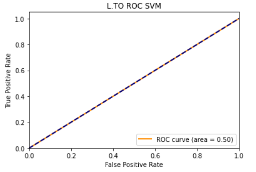

## Model Performance Evaluation

To evaluate the performance of our model we used the 4 metrics listed below. 

### Metrics:

* Classification Report
* Zero One Loss
* Matthews Correlation Coefficient
* ROC Curve 

The Classification Report includes information on the precision, recall, f1-score, and accuracy of the model. The Zero One Loss is a measure of the % of imperfectly predicted subsets. The count of such imperfectly predicted subsets was also obtained. The Matthews Correlation Coefficient (MCC) is a coefficient of +1, 0, or -1 which is representative of a perfect prediction, an average random prediction or an inverse prediction respectively. Lastly, the ROC Curve is a measure of the model performance as the descrimination threshold varies. It is better to have a larger AUC and a steeper curve as this indicates a better model performance. A steeper curve (larger slope if straight line) essentially means that the change in true positive rate is greater than the change in false positive rate for any given threshold. 

**Classification Reports**

Following are the classification reports for the 4 stocks analyzed in our project. The L.To stock had the best accuracy, precision, and f1-score and the CIX.TO stock performed the worst using our model and algorithm. However, overall it is evident that the model itself did not do so well at producing good results for the 4 stocks.

**Zero One Loss**

Next, we consider the zero one loss for the stocks and these values reiterate the results from the classification report which show that the L.TO stock did the best while the CIX.TO stock performed the worst. A lower zero one loss value is preffered.

**Zero One Loss Subsets Count**

Following is the screenshot of the count of the imperfectly predicted subsets considered in the zero one loss metric. This just shows how the CIX.TO stock which had the highest zero one loss value indeed has a higher count of imperfectly predicted subsets. Also, we can obtain the zero one loss using the values below and dividing by the support value in the classification report for each respective stock.

**Matthews Correlation Coefficient**

As can be seen from the matthews correlation coefficients below, the model performance for most stocks was average random since the coefficient was 0. The CIX.TO stock is a little below zero making it a slightly inverse prediction.   

**ROC Curve**

The ROC Curves below show what the above metrics have already shown, and that is that the model performance was not that good since the model was able to predict pretty much at random or slightly worse. The dashed blue line in the random performance line, and AUC for most stock is 0.50.

**Summary**

The following screenshot shows the metrics together in one tabular form. In summary, the one stock that performed the best using our model was the L.TO stock. But there was not much difference between all the stocks. The model did not perform so well as it was very close to a random prediction.  

